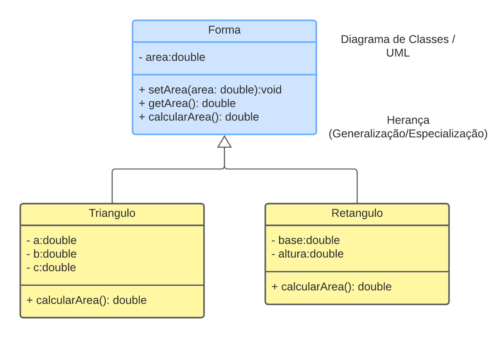

#Aula01 

Exemplo de entrada, processamento e saída.

[Código da aula-01](https://github.com/realcofre/java-exemplo/tree/aula-01)

#Aula02

Exemplo de orientação a objetos.

[Código da aula-02](https://github.com/realcofre/java-exemplo/tree/aula-02)

#Aula03

Exemplo de herança (generelização/especialização).

[Código da aula-03](https://github.com/realcofre/java-exemplo/tree/aula-03)

